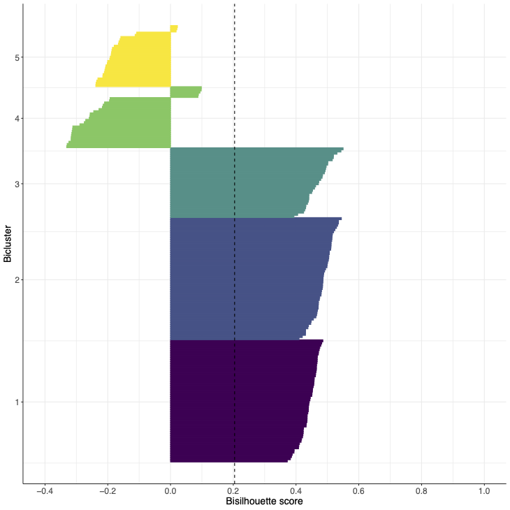
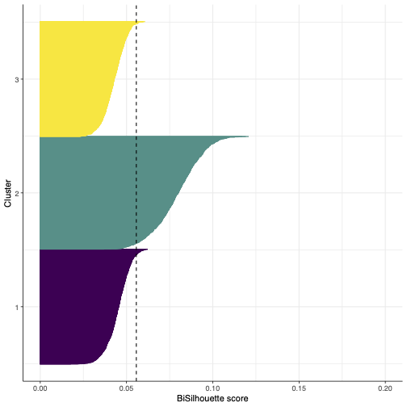

Welcome to the Github page for the `bisilhouette` package.

# Installation 
To install this package in `r` you can do any of the following
```{r}
devtools::install_github("eso28599/bisilhouette") # requires devtools package to be installed
```

# Description 
The bisilhouette score is an extension of the silhouette score to the bicluster case. It is a measure of the quality of a biclustering, which like the silhouette score takes into account the compactness and separation of the biclusters.

This page details the use of the functions within the `bisilhouette` function, for more details on the definiton of the score, please see the ..... (add link?)

# Examples 
We ilustrate the use of the `bisilhouette` function which takes as input the $N\times p$ `data` matrix, and bicluster membership informtation encoded via `row_clustering` and `col_clustering`.  

* `row_clustering`  is a Logical Matrix which contains 1 in [i,j] if row i is in bicluster j
* `col_clustering`  is a Logical Matrix which contains 1 in [i,j] if column i is in bicluster j

```{r}
data <- matrix(rnorm(50), nrow = 10)
row_clustering <- cbind(
  rbinom(10, 1, 0.5),
  rbinom(10, 1, 0.5),
  rbinom(10, 1, 0.5)
)
col_clustering <- cbind(
  rbinom(5, 1, 0.5),
  rbinom(5, 1, 0.5),
  rbinom(5, 1, 0.5)
)
bisil <- bisilhouette(data, row_clustering, col_clustering)
bisil$bisil # the bisilhouette score
bisil$vals # a list containing vectors of the bisilhouette coefficients for each bicluster 
```

The `bisilhouette` package is compatible with the output of functions from the popular `biclust`package; if `Biclust` is the object returned by the `biclust` function from the `biclust` package, bisilhouette can be used as followed:
```{r}
bisilhouette(data, Biclust@RowxNumber, Biclust@NumberxCol)
```

## Visualisation
The function `plot_bisil` produces a visualisation of the bisilhouette scores.  The individual bisilhouette coefficients for each of the rows is shown along the x axis, with rows grouped into the assigned biclusters (denoted by different colours). The mean coefficient is represented by the dashed line. 
```{r}
bisil_plot(data, row_clustering, col_clustering)
```

### Examples
1. Bisilhouette plot for synthetic data with 3 views and 5 biclusters using the true column clusters and 3 out of 5 of the correct row clusters with the remaining row clusters having been reassigned randomly.  

<p align="center">
  
</p>

2. Bisilhouette plot for biclusters obtained from a single cell transcriptomic dataset. 

<p align="center">
  
</p>


Note that the axes ranges are different as the bisilhouette score is not comporable across distinct datasets.

If you use this score in your work please cite: Orme, Ella S.C., Theodoulos Rodosthenous, and Marina Evangelou. "Multi-view biclustering via non-negative matrix tri-factorisation." arXiv e-prints (2025): arXiv-2502.
